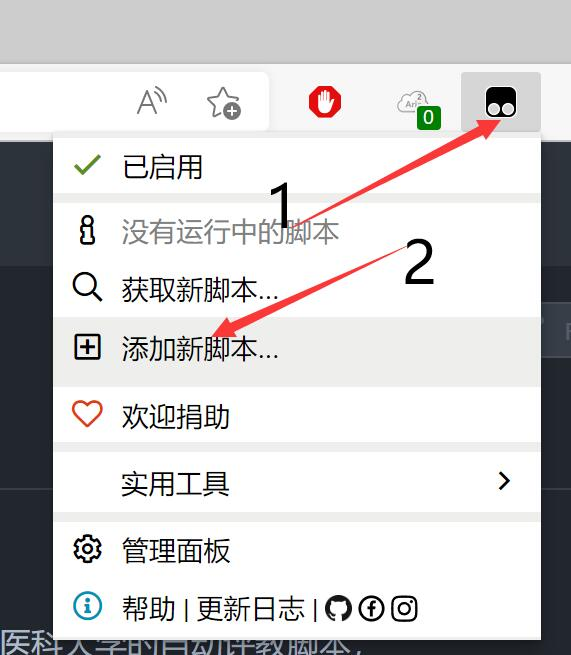
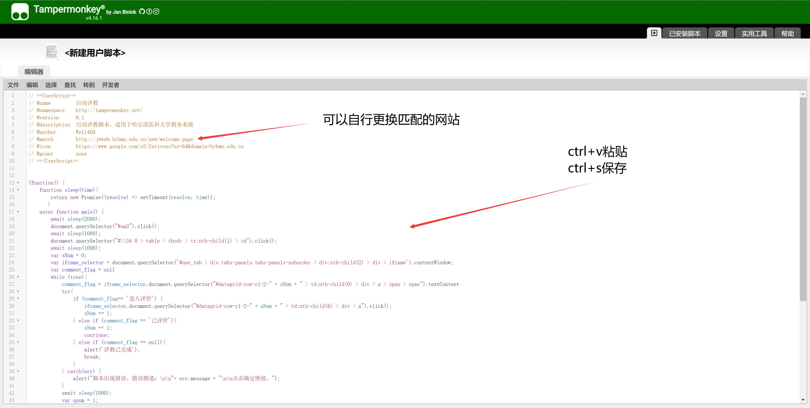

# Auto-evaluate-scripts for HMU

适用于哈尔滨医科大学的自动评教脚本，可能适用于其他基于广州乘方科技教务系统的学校

本脚本完全开源免费，由于是第一次写js可能代码很烂，如果有意见或建议欢迎提交issue或pr

## 使用方法

1. 安装油猴脚本（不会的请自行搜索）。
2. 复制 `script.js` 中的全部内容。
3. 并导入油猴脚本。

4. 登录教务系统。
5. enjoy

## 警告

由于脚本会在进入教务系统后自动工作，所以评教完毕后请务必关闭本脚本，以免对您的正常使用造成困扰。

由于本人对JavaScript的语法并不熟悉，因此采用了固定时间的等待方式，因此在网速过慢的情况下有可能会造成运行失败。可将代码中的 `await sleep(1000)` 适当增加或缩短以适应您的网速。
